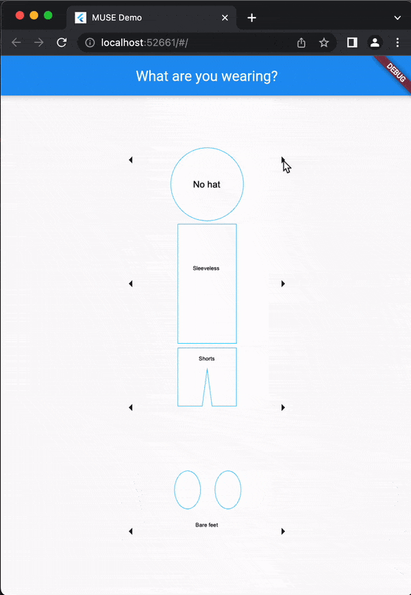

# muse_app

A flutter app for mHealth research, designed to allow users to easily track and report their UV exposure by creating an entry upon going outdoors, configuring an avatar's outfit to represent their clothing (and therefore their skin exposure), and declaring the end of the exposure period upon going indoors.

## DEMO

### TODO
- Improve graphics
- Add home page
- Make outfit selections persistent across subsequent form entries
